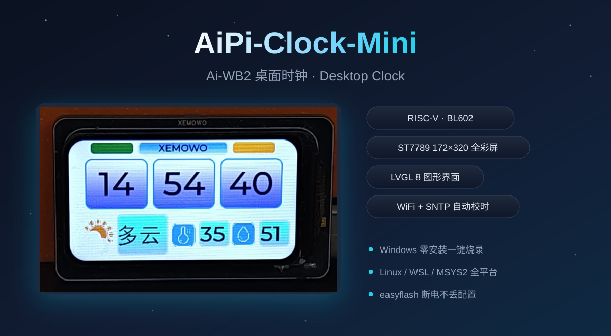

<div align="center">

# ⏰ AiPi-Clock-Mini



**Desktop Clock on Ai-WB2 (BL602)**

RISC-V · ST7789 **172×320** LCD · LVGL 8 · WiFi + SNTP

[](.)
[-00a4e4?style=flat-square)](.)
[](.)
[](.)
[](.)
[](.)
[](https://github.com/XEMOWO/ai-wb2-clock/releases)

**[🇬🇧 English](#readme-en) · [🇨🇳 中文](#readme-zh)**

</div>

<a id="readme-en"></a>

---

## 📖 English

An LVGL desktop clock built on **Ai-WB2 (BL602)**: out of the box it shows the
time (NTP-synced) and connects to WiFi via phone provisioning — the weather,
wallpaper playback, status lamp and the PC companion app are **built-in but
disabled by default** (second-dev scope, see below).

### ✨ Features

**🎉 Factory default (flash-and-go — nothing else to configure):**

| What | Details |
|------|---------|
| 🖥️ Display | Full-color **172×320** LCD over **hardware SPI @ 40 MHz**; GUI Guider designed UI on **LVGL 8** |
| 📶 WiFi | **No WiFi preloaded** — first boot goes straight into *phone provisioning*: open the open AP `Clock-Mini-XXXX`, then `192.168.169.1` in the browser |
| ⏰ Time | NTP / SNTP **automatic time sync** once connected; clock UI with scroll animation & gradient background |
| ⌨️ Commands | xcmd UART commands — change WiFi / city on the fly |
| 💾 Storage | easyflash persistence — settings survive power-off |
| 🪟 Flashing | One-click Windows flashing (zero install); Linux / WSL / MSYS2 supported |

**🛠️ Optional (built in, OFF by default — second-dev scope).**
These ship in the firmware but are disabled until you switch them on (most are
driven from the [PC companion app](#-pc-companion-app-wb2serialtool)):

| Feature | Factory state | How to enable |
|---------|---------------|---------------|
| 🌦️ Weather (icons + temperature / humidity) | **off** (`wx_on = 0`) | set `wx_on = 1` in `WB2-clock2/xcmd/cfg_store.c` and re-flash — the Gaode (amap) key is already pre-loaded; switch provider / key afterwards via `#XWXAPI` / `#XWXKEY` |
| 🖼️ Wallpaper playback | **off** (`wall_mode = 0`) | companion app “Wallpaper” card (uploads image over UART, sets wallpaper/clock display duration & animation) |
| 🏞️ Boot image | **none** (`wall_valid = 0`) | companion app “Boot image” card (full-screen 320×220, shows 2 s then clock) |
| 💡 Status lamp / monitor | **off** (`mon_on = 0`) | `#XLAMP,0-4` and `#XMON,1` serial commands |
| 🎨 Clock style & background | scroll animation **on**, blue-purple gradient | `#XCLOCK` / `#XBG` commands or the app’s color picker |
| 🖥️ PC companion app | separate app — **not firmware-dependent** | run `serial_tool/dist/WB2SerialTool.exe`; see below |

### 🖥️ PC Companion App (WB2SerialTool)

The PC software used with this project is **`serial_tool/dist/WB2SerialTool.exe`** —
a single-file Windows GUI app, **no installation required**, run it directly.
It talks to the board over UART (same protocol as the firmware's `xcmd`):

| Capability | Description |
|-----------|-------------|
| 📡 Serial | Port / baud setup (default **2 Mbps**), connection status |
| 📶 WiFi | Push SSID / password / city on the fly |
| 🌦️ Weather | Set weather API provider (Gaode / QWeather) and keys |
| 🖼️ Wallpaper | Upload images over UART (no flasher needed), set playback animation |
| ⏱️ Timing | Independent display seconds for **wallpaper** and **clock** (1–60 s) |
| 🎨 Background | Color picker for clock-screen background + gradient direction (solid / horizontal / vertical) |
| 🔘 Quick | One-click command buttons (ping / status / version) |

Settings persist to `config.json` next to the exe. Source lives in
[`serial_tool/`](serial_tool/) (PySide6 + qfluentwidgets); rebuild with
`build.bat` (PyInstaller).

> 💡 Everything in the app can also be sent by hand — see
> [Serial Protocol](#-serial-protocol-xcmd) below.

### 🔌 Wiring

| ST7789 | WB2 Pin | | ST7789 | WB2 Pin |
|--------|---------|---|--------|---------|
| SCL (SCK) | **GPIO 3** | | VCC | **3.3V** |
| SDA (MOSI) | **GPIO 12** | | GND | **GND** |
| CS | **GPIO 14** | | DC | **GPIO 4** |
| RST | **GPIO 17** | | — | — |

> ⚠️ Wrong pins won't damage the board — but never reverse **VCC/GND**.

### 🚀 Quick Start

**Method 1 — Windows one-click (zero install)**

1. Get this repo: green **Code → Download ZIP** (or `git clone`), then extract
2. Open `Windows烧录/` → double-click `一键烧录.bat` *(flash tool, prebuilt firmware & 70+ flash configs all inside the repo — nothing else to install)*
3. Enter the COM port (e.g. `COM3` from Device Manager)
4. When prompted: **hold BOOT → tap RST → release BOOT**
5. Done — it flashes automatically!

> This repo is self-contained for flashing — **no SDK, no compiler**. Only the CH340 driver is needed (usually auto-installed on Win10+).

**Method 2 — Linux / WSL script** *(requires the SDK, same as Method 3; just flashing → Method 1)*

```bash
./flash.sh                     # build → pick port → pick baud → flash
./flash.sh /dev/ttyUSB0 921600 # no interaction
./flash.sh --no-sync           # code-only changes, skip UI sync
```

> Serial permission (once): `sudo usermod -aG dialout $USER`
> If flashing stalls: **hold BOOT → tap RST** to re-enter download mode.

**Method 3 — build from source** *(requires the SDK — see the expanded section below)*

```bash
git clone https://github.com/XEMOWO/AiPi-Clock-Mini
cd AiPi-Clock-Mini

make -j8                       # build only
make flash SERIAL_PORT=/dev/ttyUSB0 SERIAL_BAUDRATE=921600
```

> ⚠️ **This repo does NOT contain the SDK** — no `components/`, `toolchain/` or `make_scripts_riscv/`. Compiling requires an external SDK; follow the expanded section below. Only want to flash? Use **Method 1** — nothing to install.

<details>
<summary><b>🧰 Set up a custom SDK environment</b> (click to expand)</summary>

> **This repo ships source only — no SDK.** Building requires an external [Ai-Thinker-WB2 SDK](https://gitee.com/Ai-Thinker-Open/Ai-Thinker-WB2); the steps below set it up once:

1. **Clone the SDK + submodules**

```bash
git clone https://gitee.com/Ai-Thinker-Open/Ai-Thinker-WB2
cd Ai-Thinker-WB2
git submodule update --init --recursive    # toolchain + flash tool — required!
```

2. **Apply a required patch** (otherwise colors are all wrong)

GUI Guider exports RGB565 little-endian images, but the SDK defaults to `LV_COLOR_16_SWAP=1`:

```bash
sed -i 's/#define LV_COLOR_16_SWAP 1/#define LV_COLOR_16_SWAP 0/' \
    components/stage/lvgl/lv_conf.h
```

3. **Place the project** (either way)

```bash
# A (recommended): inside the SDK's applications dir — path auto-detected
cp -r WB2-clock2 applications/xemowo/

# B: anywhere, point to the SDK manually
export BL60X_SDK_PATH=/path/to/Ai-Thinker-WB2
```

> SDK path resolution: env `BL60X_SDK_PATH` → parent-dir auto-detect → Makefile fallback.

4. **Flash**: chip **BL602**, flash size **2M**, file `build_out/WB2-clock2.bin`.

</details>

### 📁 Project Structure

```
WB2-clock2/
├── Makefile              # Build entry (auto SDK path resolution)
├── proj_config.mk        # Chip/feature config (2M flash, WiFi, LVGL…)
├── flash.sh              # One-click: sync UI + build + flash
├── sync_gui.sh           # GUI Guider → project sync (UI devs only)
├── Windows烧录/           # Windows zero-install flashing (self-contained)
├── serial_tool/          # PC companion app (PySide6 source + exe)
│   ├── dist/WB2SerialTool.exe  # ⭐ The PC software you actually run
│   ├── main.py           # App entry (PyInstaller target)
│   ├── app/              # Serial, protocol, WiFi/weather/wallpaper widgets
│   └── build.bat         # Rebuild exe on Windows
└── WB2-clock2/           # Source (dir name must match outer dir)
    ├── main.c            # Entry: LCD(hardware SPI @ 40 MHz) + LVGL + WiFi + SNTP
    ├── custom/           # ⚠ Hand-written code, never synced by GUI Guider
    │   ├── custom.c/h    # Business logic (widgets, weather text/icon map)
    │   ├── weather.c     # Weather task: Gaode (HTTP) / QWeather (HTTPS+gzip) / Open-Meteo
    │   ├── gz.c/h        # Minimal gzip inflate (QWeather forces gzip)
    │   └── lv_font_cn.c  # Chinese font
    ├── generated/        # GUI Guider output (LVGL 9→8 converted)
    ├── assets/           # Fonts / images
    └── xcmd/             # UART commands + easyflash config storage
```

### ⚙️ Configuration

| Item | Default | Where to change |
|------|---------|-----------------|
| WiFi SSID | 出厂无默认 (首次开机自动进配网) | `DEFAULT_SSID` in `WB2-clock2/xcmd/cfg_store.c`, or live via xcmd |
| WiFi password | 出厂无默认 | `DEFAULT_PWD` |
| City (weather) | `440306` Shenzhen Bao'an | `DEFAULT_CITY` |
| Weather provider | `amap` | `DEFAULT_WXAPI` in `cfg_store.c`, or `#XWXAPI` over UART |
| UART (log/xcmd) | 2 Mbps 8N1 | hardware connection |

> Config is stored in flash (easyflash) and survives reboot.

### 🌦️ Weather API (3 sources)

> 🚨 Weather is **off by default** (`wx_on = 0` in `WB2-clock2/xcmd/cfg_store.c`).
> Set it to `1` and re-flash first, then everything below applies (the amap key
> is pre-loaded). See [Optional](#-features) above.

Three providers, switchable live over UART (`#XWXAPI`); API keys are sent by the host over UART (`#XWXKEY`) and stored in flash:

| Provider | Notes |
|----------|-------|
| `amap` (Gaode, default) | plain HTTP :80, city = adcode or Chinese name |
| `qweather` (QWeather) | HTTPS + TLS (SDK mbedtls, no CA verify) + on-device gzip decode |
| `openmeteo` (Open-Meteo) | **no API key needed**, built-in, works out of the box |

QWeather first resolves the city to a LocationID via `geoapi` (adcode **or** Chinese name both work — existing city config needs no migration), then queries the `now` API (auth via `X-QW-Api-Key` header). Weather text and icons reuse the same mappings as Gaode — no UI changes needed. Open-Meteo needs no key at all — pick it when you have none.

### ⌨️ Serial Protocol (xcmd)

Lines start with `#X`; value fields are UTF-8 bytes hex-encoded (HEX); every command acks with `#XA,<OK|ERR>,<CMD>[,hex data]`:

| Command | Meaning |
|---------|---------|
| `#XVER` | firmware version |
| `#XST` | status → `#XST,<state>,<ssid>,<ip>,<rssi>,<time>,<city>,<wxapi>` |
| `#XCFG,<hex ssid>,<hex pwd>,<hex city>` | set config (empty field = keep) |
| `#XCITY,<hex city>` | change city, triggers instant weather refresh |
| `#XWXCITY,<hex name>` | resolve city name → weather LocationID |
| `#XMON,<0\|1>` | Claude Code status-light monitor toggle |
| `#XLAMP,<0-4>` | Claude Code status light |
| `#XWXAPI,<hex "amap"\|"qweather"\|"openmeteo">` | switch weather provider (**3 sources**) |
| `#XWXKEY,<hex provider>,<hex key>[,<hex cred>]` | set API key (qweather: key + optional legacy credential id) |
| `#XCLOCK,<0\|1>` | clock page-turn animation toggle |
| `#XBG,<hex c1>,<hex c2>,<dir>` | clock background color / gradient direction |
| `#XWALL,<mode>,<sec>,<anim>,<clksec>` | wallpaper slideshow config (on / sec / anim / clock sec) |
| `#XIMGSTART,<total>` `#XIMG,<seq>,<len>,<hex>,<chk>` `#XIMGEND` | upload image over UART (chunked, hex+checksum) |
| `#XBOOTIMG` | upload / clear custom boot logo |
| `#XBOOTCLR` | clear boot counter |

Device → PC: every command acks with `#XA,<OK|ERR>,<CMD>[,hex data]`; events push as `#XEV,<ev>[,data]` (e.g. `GOT_IP`, `WIFI_DISCONNECT`).

Example — switch to QWeather and set the API key:

```
#XWXAPI,716d656174686572
#XWXKEY,7177656174686572,3631363232643131626666633437366161313062333665303863306630663461
```

### 🧑‍💻 For Developers

- **`custom/` is never synced** by GUI Guider (disabled in the script) — edit it directly
- **Change UI**: edit in GUI Guider (LVGL 9) → `./sync_gui.sh` (auto LVGL 9→8 conversion) → `./flash.sh`
- **Code-only changes**: `./flash.sh --no-sync`
- GUI Guider project path: `SRC` variable at the top of `sync_gui.sh` (local-only)

### ❓ FAQ

| Problem | Solution |
|---------|----------|
| Flashing stuck waiting for device | **hold BOOT → tap RST** to re-enter download mode |
| Colors all wrong | `LV_COLOR_16_SWAP` must be **0** in `lv_conf.h` (see patch) |
| Cannot connect to WiFi | Check SSID/password (`cfg_store.c` defaults / xcmd) |
| `BL60X_SDK_PATH` errors | Check SDK path (see "custom SDK environment") |
| No COM port in Device Manager | Install **CH340 driver**, replug USB |
| `BFLB FLASH MATCH TYPE FAIL` | Log `readdata: b'xxxxxxxx'` → take first 6 hex digits (e.g. `5e4016`) → copy a `.conf` from `Windows烧录/utils/flash/bl602/` and rename it `<MODEL>_<first6>.conf` |

---

<a id="readme-zh"></a>

<div align="center">

# 🇨🇳 中文版

</div>

## 📖 中文

基于 **Ai-WB2 (BL602)** 的桌面时钟：出厂默认就是「显示时间」——手机配网连上
WiFi 后 SNTP 自动校时、LVGL 时钟界面。天气、壁纸、状态灯、上位机等扩展功能**已
内置但默认关闭**，属于二次开发范畴（见下方「可选」）。

### ✨ 特性

**🎉 出厂默认功能（烧录即用，什么都不用配）：**

| 功能 | 说明 |
|------|------|
| 🖥️ 屏幕 | **172×320** 全彩 LCD（硬件 SPI @ 40MHz），GUI Guider 设计的 **LVGL 8** 界面 |
| 📶 配网 | **出厂不预置 WiFi** —— 首次开机直接进入手机配网：连上无密码热点 `Clock-Mini-XXXX`，浏览器打开 `192.168.169.1` 填路由 WiFi |
| ⏰ 时间 | 连网后 **SNTP 自动校时**；时钟界面自带滚动翻页动画、渐变背景 |
| ⌨️ 命令 | xcmd 串口命令，在线改 WiFi / 城市 |
| 💾 存储 | easyflash 持久化，断电不丢 |
| 🪟 烧录 | Windows 一键烧录（零安装），支持 Linux / WSL / MSYS2 |

**🛠️ 可选（内置但默认关闭，二次开发范畴）。**
固件里已有这些代码，默认关闭；先在代码里开或由配套上位机开启（多数用
[上位机](#-pc-配套软件wb2serialtool) 驱动）：

| 功能 | 出厂状态 | 怎么开启 |
|------|---------|---------|
| 🌦️ 天气（图标 + 大气温湿度） | **关**（`wx_on = 0`） | 改 `WB2-clock2/xcmd/cfg_store.c` 里 `wx_on = 0` 为 `1` 后重新烧录——高德 API Key 已内置；之后可用 `#XWXAPI` / `#XWXKEY` 换天气源 / Key |
| 🖼️ 壁纸图播放 | **关**（`wall_mode = 0`） | 上位机「壁纸」卡片：串口上传图片，设壁纸/时钟各自显示时长与切换动画 |
| 🏞️ 开机图 | **无**（`wall_valid = 0`） | 上位机「开机图」卡片：全屏 320×220 上传，上电显示 2 秒后进时钟 |
| 💡 状态灯 / 监控 | **关**（`mon_on = 0`） | 串口命令 `#XLAMP,0-4`（状态灯）和 `#XMON,1`（监控开关） |
| 🎨 时钟样式 / 背景 | 滚动翻页**开**、蓝紫渐变 | `#XCLOCK` / `#XBG` 命令，或上位机背景颜色面板 |
| 🖥️ 上位机软件 | 独立软件，**与固件无关** | 直接运行 `serial_tool/dist/WB2SerialTool.exe`，见下节 |

### 🖥️ PC 配套软件（WB2SerialTool）

本项目配套的 PC 软件就是 **`serial_tool/dist/WB2SerialTool.exe`** ——
Windows 单文件 GUI，**免安装，直接双击运行**，通过串口和板子通信
（协议与固件 `xcmd` 完全一致）：

| 功能 | 说明 |
|------|------|
| 📡 串口 | 端口 / 波特率设置（默认 **2Mbps**）、连接状态 |
| 📶 WiFi | 在线下发 SSID / 密码 / 城市 |
| 🌦️ 天气 | 切换天气源（高德 / 和风）并下发 API Key |
| 🖼️ 壁纸 | 串口直接上传图片（无需烧录器），可选切换动画 |
| ⏱️ 时长 | **图片**与**时钟**各自独立的显示秒数（1–60 秒） |
| 🎨 背景 | 时钟屏背景颜色面板 + 渐变方向（纯色 / 水平 / 垂直） |
| 🔘 快捷 | 一键命令按钮（PING / 状态 / 版本） |

设置自动保存到 exe 同目录的 `config.json`。源码在
[`serial_tool/`](serial_tool/)（PySide6 + qfluentwidgets），
Windows 上跑 `build.bat` 即可用 PyInstaller 重新打包。

> 💡 软件里能发的命令，手工串口也能发——格式见下方
> [串口协议](#-串口协议xcmd)。

### 🔌 接线

| ST7789 屏 | WB2 引脚 | | ST7789 屏 | WB2 引脚 |
|-----------|---------|---|-----------|---------|
| SCL (SCK) | **GPIO 3** | | VCC | **3.3V** |
| SDA (MOSI) | **GPIO 12** | | GND | **GND** |
| CS | **GPIO 14** | | DC | **GPIO 4** |
| RST | **GPIO 17** | | — | — |

> ⚠️ 接错线不会烧板，但 **VCC/GND 千万别反接**。

### 🚀 快速开始

**方法一：Windows 一键烧录（零安装）**

1. 获取本仓库：绿色 **Code → Download ZIP**（或 `git clone`），然后解压
2. 打开 `Windows烧录/` → **双击 `一键烧录.bat`**（烧录工具、预编译固件、70+ 型号 flash 配置全都在仓库里，什么都不用装）
3. 输入串口号（设备管理器查看，如 `COM3`）
4. 提示时**按住 BOOT → 按一下 RST → 松开 BOOT**
5. 自动烧完，开机！

> 只烧录时本仓库是自包含的——**不需要 SDK、不需要编译器**，只需 CH340 驱动（Win10+ 一般自动装）。

**方法二：Linux / WSL 脚本**（需 SDK 环境，同方法三；只想烧录用方法一）

```bash
./flash.sh                     # 编译 → 选串口 → 选波特率 → 烧录
./flash.sh /dev/ttyUSB0 921600 # 直接指定，无交互
./flash.sh --no-sync           # 只改代码，跳过 UI 同步
```

> 串口权限（一次）：`sudo usermod -aG dialout $USER`
> 卡住时：**按住 BOOT → 按 RST** 重新进入下载模式。

**方法三：从源码编译**（需先装 SDK，见下方展开）

```bash
git clone https://github.com/XEMOWO/AiPi-Clock-Mini
cd AiPi-Clock-Mini

make -j8                       # 只编译
make flash SERIAL_PORT=/dev/ttyUSB0 SERIAL_BAUDRATE=921600
```

> ⚠️ **本仓库不含 SDK** —— 没有 `components/`、`toolchain/`、`make_scripts_riscv/`。要编译必须先克隆 SDK，按下方展开章节操作。只想烧录？用**方法一**，零安装。

<details>
<summary><b>🧰 用官方 SDK 自己搭环境</b>（点击展开）</summary>

> **本仓库只含项目源码——不含 SDK**。编译需要外部的 [Ai-Thinker-WB2 SDK](https://gitee.com/Ai-Thinker-Open/Ai-Thinker-WB2)，下面步骤一次性配齐：

1. **克隆 SDK + 子模块**

```bash
git clone https://gitee.com/Ai-Thinker-Open/Ai-Thinker-WB2
cd Ai-Thinker-WB2
git submodule update --init --recursive    # 工具链 + 烧录工具，必需！
```

2. **打一个必须的补丁**（否则图片颜色全错）

GUI Guider 导出的 RGB565 图片是小端，而 SDK 默认 `LV_COLOR_16_SWAP=1`：

```bash
sed -i 's/#define LV_COLOR_16_SWAP 1/#define LV_COLOR_16_SWAP 0/' \
    components/stage/lvgl/lv_conf.h
```

3. **放项目**（二选一）

```bash
# A（推荐）: 放进 SDK applications，路径自动识别
cp -r WB2-clock2 applications/xemowo/

# B: 任意位置，手动指定 SDK 路径
export BL60X_SDK_PATH=/你的/Ai-Thinker-WB2 路径
```

> SDK 路径解析：环境变量 `BL60X_SDK_PATH` → 上级目录自动探测 → Makefile 兜底。

4. **烧录时**：芯片选 **BL602**，Flash **2M**，选 `build_out/WB2-clock2.bin`。

</details>

### 📁 项目结构

```
WB2-clock2/
├── Makefile              # 构建入口（SDK 路径自动解析）
├── proj_config.mk        # 芯片/功能配置（2M flash、WiFi、LVGL…）
├── flash.sh              # 一键: 同步UI + 编译 + 选串口/波特率 + 烧录
├── sync_gui.sh           # GUI Guider → 项目同步（仅 UI 开发者）
├── Windows烧录/           # Windows 零安装一键烧录（工具全内置）
├── serial_tool/          # PC 配套软件（PySide6 源码 + exe）
│   ├── dist/WB2SerialTool.exe  # ⭐ 日常使用的就是它
│   ├── main.py           # 程序入口（PyInstaller 打包目标）
│   ├── app/              # 串口/协议/WiFi/天气/壁纸面板
│   └── build.bat         # Windows 下重新打包 exe
└── WB2-clock2/           # 源码（目录名必须与外层同名）
    ├── main.c            # 入口: LCD(硬件SPI 40MHz) + LVGL + WiFi + SNTP
    ├── custom/           # ⚠ 手写代码，不随 GUI Guider 同步
    │   ├── custom.c/h    # 业务逻辑（控件定制、天气文字/图标映射）
    │   ├── weather.c     # 天气任务：高德(HTTP) / 和风(HTTPS+gzip) / Open-Meteo
    │   ├── gz.c/h        # 极简 gzip 解压（和风强制 gzip）
    │   └── lv_font_cn.c  # 中文字库
    ├── generated/        # GUI Guider 生成（LVGL 9→8 已转换）
    ├── assets/           # 字体/图片
    └── xcmd/             # 串口命令 + easyflash 配置存储
```

### ⚙️ 配置

| 配置项 | 默认值 | 改哪里 |
|--------|--------|--------|
| WiFi SSID | 出厂无默认（首次开机自动进配网） | `WB2-clock2/xcmd/cfg_store.c` 的 `DEFAULT_SSID`，或串口 xcmd 在线改 |
| WiFi 密码 | 出厂无默认 | `DEFAULT_PWD` |
| 城市（天气） | `440306` 深圳宝安 | `DEFAULT_CITY` |
| 天气源 | `amap` | `cfg_store.c` 的 `DEFAULT_WXAPI`，或串口 `#XWXAPI` 在线切 |
| 串口（日志/xcmd） | 2M bps 8N1 | 硬件连接 |

> 配置存 flash（easyflash），在线改完重启不丢。

### 🌦️ 天气 API（三源）

> 🚨 天气**出厂默认关闭**（`WB2-clock2/xcmd/cfg_store.c` 里 `wx_on = 0`）。
> 先改成 `1` 重新烧录，下面这些才生效（高德 Key 已内置）。详见上方
> [可选功能](#-特性)。

三个天气源，串口 `#XWXAPI` 在线切换；API Key 由串口 `#XWXKEY` 下发并存入 flash：

| 天气源 | 说明 |
|--------|------|
| `amap`（高德，默认） | 明文 HTTP :80，城市=adcode 或中文名 |
| `qweather`（和风） | HTTPS + TLS（SDK mbedtls，不校验证书）+ 板端 gzip 解压 |
| `openmeteo`（Open-Meteo） | **免 API Key**，内置，开箱即用 |

和风先用 `geoapi` 把城市反查成 LocationID（adcode **和**中文名都支持——现有城市配置无需迁移），再查 `now` 实时接口（认证走 `X-QW-Api-Key` 请求头）。天气文字和图标复用高德的映射，UI 无需改动。Open-Meteo 无需任何 Key，适合无 Key 场景直接使用。

### ⌨️ 串口协议（xcmd）

行以 `#X` 开头；值字段为 UTF-8 字节的 hex；每条命令回 `#XA,<OK|ERR>,<CMD>[,hex data]`：

| 命令 | 含义 |
|------|------|
| `#XVER` | 固件版本 |
| `#XST` | 状态 → `#XST,<state>,<ssid>,<ip>,<rssi>,<time>,<city>,<wxapi>` |
| `#XCFG,<hex ssid>,<hex pwd>,<hex city>` | 写配置（字段留空=不改） |
| `#XCITY,<hex city>` | 改城市，触发天气立即重查 |
| `#XWXCITY,<hex 城市名>` | 城市名反查天气 LocationID |
| `#XMON,<0\|1>` | Claude Code 状态灯监控开关 |
| `#XLAMP,<0-4>` | Claude Code 状态灯 |
| `#XWXAPI,<hex "amap"\|"qweather"\|"openmeteo">` | 切换天气源（**三源**） |
| `#XWXKEY,<hex provider>,<hex key>[,<hex cred>]` | 下发 API Key（和风：key + 可选旧版凭据ID） |
| `#XCLOCK,<0\|1>` | 时钟翻页动画开关 |
| `#XBG,<hex c1>,<hex c2>,<dir>` | 时钟背景颜色/渐变方向 |
| `#XWALL,<mode>,<sec>,<anim>,<clksec>` | 壁纸轮播配置（开关/时长/动画/时钟时长） |
| `#XIMGSTART,<total>` `#XIMG,<seq>,<len>,<hex>,<chk>` `#XIMGEND` | 串口分块上传图片（hex+校验） |
| `#XBOOTIMG` | 上传/清除自定义开机图 |
| `#XBOOTCLR` | 清零开机计数 |

示例——切到和风并下发 Key：

```
#XWXAPI,716d656174686572
#XWXKEY,7177656174686572,3631363232643131626666633437366161313062333665303863306630663461
```

### 🧑‍💻 开发者注意事项

- **`custom/` 不会也不该被 GUI Guider 同步**（脚本已禁用），直接编辑即可
- **改 UI**：GUI Guider（LVGL 9）改 → `./sync_gui.sh`（自动 LVGL 9→8 转换）→ `./flash.sh`
- **只改业务代码**：`./flash.sh --no-sync`
- GUI Guider 工程路径在 `sync_gui.sh` 顶部 `SRC` 变量（仅本机有效）

### ❓ FAQ

| 现象 | 解决 |
|------|------|
| 烧录卡在等待设备 | 按住 **BOOT** 再按 **RST**，重新进入下载模式 |
| 图片颜色全错 | `lv_conf.h` 里 `LV_COLOR_16_SWAP` 必须是 **0**（见补丁） |
| 连不上 WiFi | 检查 SSID/密码（`cfg_store.c` 默认值 / xcmd 修改） |
| 编译报 `BL60X_SDK_PATH` 错误 | 检查 SDK 路径（见"搭环境"） |
| 设备管理器看不到串口 | 装 **CH340 驱动**，重新插拔 |
| 报 `BFLB FLASH MATCH TYPE FAIL` | 日志 `readdata: b'xxxxxxxx'` 取前 6 位（如 `5e4016`），在 `Windows烧录/utils/flash/bl602/` 复制一个 `.conf` 改名为 `<型号>_<前6位>.conf` |

---

<div align="center">

**喜欢的话点个 ⭐ Star 支持一下！**
*If you like it, give it a ⭐!*

</div>
